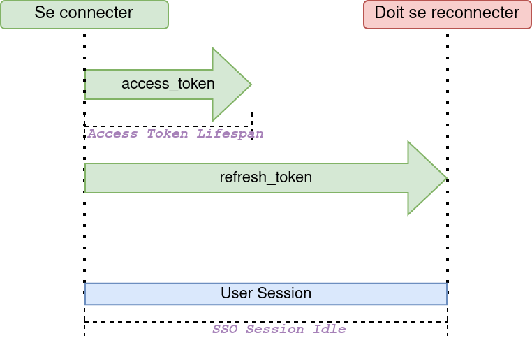
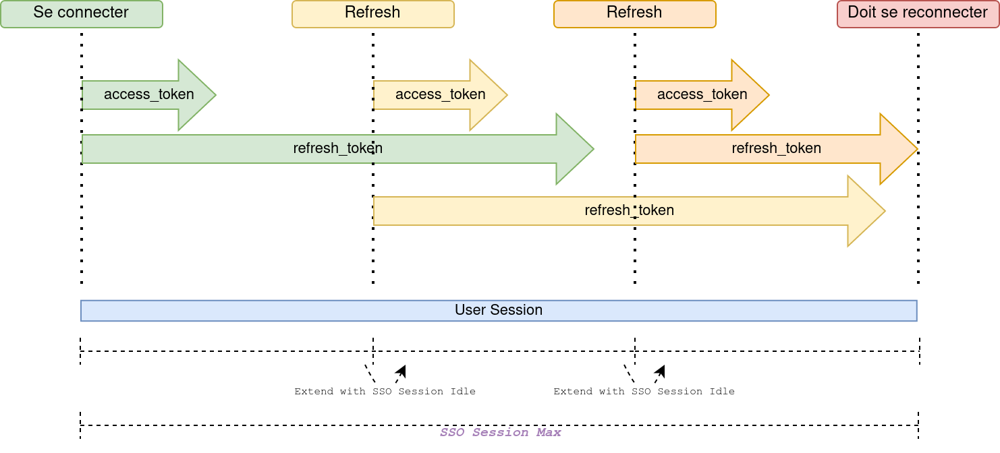

= Applications

[%notitle]
== SSO avec Keycloak (part1)

[.stretch]
[plantuml, target=sso, format=svg]
....
include::images/sso-part1.plantuml[]
....

[%notitle]
== SSO avec Keycloak (part2)

[.stretch]
[plantuml, target=sso, format=svg]
....
include::images/sso-part2.plantuml[]
....

== Sessions

== Sessions

== API (Java SpringBoot)

Configuration

== Application BackEnd (Java SpringBoot)

Configuration

== Application FrontEnd (Javascript)

Configuration

== Roles

Configuration

== Client scopes

Configuration
